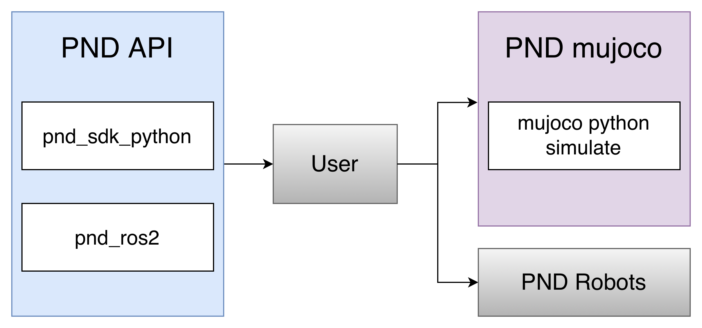

# PND Mujoco



<div align="center">

[](https://releases.ubuntu.com/22.04/)
[](https://mujoco.org/)
[](https://www.python.org/downloads/)
[](https://cyclonedds.io/)
[](https://docs.ros.org/en/humble/)


[](https://opensource.org/licenses/BSD-3-Clause)
[](https://github.com/pndbotics/pnd_mujoco/issues)


**A lightweight simulation framework integrating PND SDK and MuJoCo for rapid sim‑to‑real development. The repository provides two versions of the simulator, implemented respectively using Python CycloneDDS and Python ROS2 Humble.**

</div>

## ✨ Features

- **Plug‑and‑Play Sim‑to‑Real**: Run the same controller code in both simulation and real robots  
- **Full PND SDK Compatibility**: Supports PND LowCmd/LowState messaging  
- **ROS2 / DDS Support**: Select between ROS2 or pure DDS communication  
- **PND Robot Models Included**: MJCF models for PND Adam‑U and others  
- **Python & C++ APIs**: Unified control interface across platforms  

## 📋 Table of Contents

- [What's New](#-whats-new)
- [Installation](#-installation)
- [Quick Start](#-quick-start)
- [Usage Examples](#-usage-examples)
- [API Reference](#-api-reference)
- [Troubleshooting](#-troubleshooting)
- [Contributing](#-contributing)
- [License](#-license)
- [Reference](#-referecnce)
- [Acknowledgement](#-acknowledgement)
- [Contact](#-contact)
- [Version Log](#-version-log)

## 🆕 What's New

### Latest Release — v1.0.3 (2025)

#### 🚀 New Features
- Python-based MuJoCo simulator using pnd_sdk_python
- C++ simulator using pnd_sdk
- Virtual elastic-band hoist for humanoid stability debugging
- ROS2 Humble compatibility

#### 🐛 Bug Fixes
- Fixed DDS domain conflict issues  
- Fixed joystick input offset issues

#### ⚡ Performance Improvements
- Reduced simulation step latency  
- Improved synchronization between viewer and physics steps

## 🛠 Installation

### Prerequisites

- **Ubuntu 22.04**
- **Python 3.8+**
- **MuJoCo 3.2.0**
- **Cyclonedds**
- **ROS2 Humble (optional)**

### C++ Simulator Installation

#### Dependencies
```bash
sudo apt install libyaml-cpp-dev libspdlog-dev libboost-all-dev libglfw3-dev
```

### Python Simulator Installation (`simulate_python`)

#### 1. Install pnd_sdk_python
```bash
cd ~
sudo apt install python3-pip
git clone https://github.com/pndbotics/pnd_sdk_python.git
cd pnd_sdk_python
pip3 install -e .
```

#### 2. Install MuJoCo Python
```bash
pip3 install mujoco==3.2.0
```

#### 3. Install joystick support
```bash
pip3 install pygame
```

#### 4. Test Simulation
```bash
cd simulate_python
python3 pnd_mujoco.py
```

Open another terminal:
```bash
python3 example/python/open_arm.py
```

The Adam‑U robot in simulation will lift and lower its arm.


## 🚀 Quick Start

### Python Simulator Configuration  
Configuration file: `simulate_python/config.py`

```python
ROBOT = "adam_u"

# Robot simulation scene file
ROBOT_SCENE = "../pnd_robots/" + ROBOT + "/scene.xml" # Robot scene


# dds domain id. It is recommended to use a different one from the real robot (real robot defaults to 0)
Separate startup for ROS2 or DDS and their corresponding IDs
# For ROS2
SDK_TYPE="ROS2" # "ROS2" or "DDS"
DOMAIN_ID = 2 # Domain id

# For DDS
SDK_TYPE="DDS" # "ROS2" or "DDS"
DOMAIN_ID = 1 # Domain id

# Network interface name. For simulation, it is recommended to use the local loopback "lo"
INTERFACE = "lo" # Interface

# Whether to print robot link, joint, sensor and other information. True means print enabled
PRINT_SCENE_INFORMATION = True

USE_JOYSTICK = 1 # Simulate PND WirelessController using a gamepad
JOYSTICK_TYPE = "xbox" # support "xbox" and "switch" gamepad layout
JOYSTICK_DEVICE = 0 # Joystick number

# Whether to use the virtual elastic band. 1 means enabled
# Mainly used to simulate the hanging state during adam robot initialization
ENABLE_ELASTIC_BAND = False

# Simulation timestep (s)
# To ensure simulation stability, the timestep must be larger than the rendering time of one viewer.sync() call
SIMULATE_DT = 0.003

# Visualization timestep. 0.02 corresponds to 50fps
VIEWER_DT = 0.02

```

## 📖 Usage Examples

### Humanoid Virtual Hoist  
To simulate the suspension & release process of humanoid robots:
- Enable in config:
```python
ENABLE_ELASTIC_BAND = True
```
- Controls:
    - `9` — engage/release hoist  
    - `7` — lower robot  
    - `8` — lift robot  

### Sim to Real

Examples located in `example/`:

| Folder   | Description                            |
| -------- | -------------------------------------- |
| `cpp`    | C++ examples using `pnd_sdk`          |
| `python` | Python examples using `pnd_sdk_python` |
| `ros2`   | ROS2 examples using `pnd_ros2`         |

### Python Example: Sim vs Real

```bash
python3 ./open_arm.py           # simulation
python3 ./open_arm.py enp3s0    # real robot (network interface)

```

Program logic:
```python
if len(sys.argv) < 2:
    ChannelFactoryInitialize(1, "lo")   # simulation
else:
    ChannelFactoryInitialize(1, sys.argv[1])   # real robot
```

## 🔧 API Reference

### ROS2 Example

#### 1. Build
```bash
source ~/pnd_ros2/setup.sh
cd example/ros2
colcon build
```

#### 2. Run in simulation
```bash
source ~/pnd_ros2/setup_local.sh
export ROS_DOMAIN_ID=2
./install/open_arm/bin/open_arm
```

#### 3. Run on real robot
```bash
source ~/pnd_ros2/setup.sh
export ROS_DOMAIN_ID=2
./install/open_arm/bin/open_arm
```

### Supported PND SDK Messages

- `LowCmd` — motor control command
- `LowState` — motor state feedback

### Message (DDS IDL) Type
The PND Adam-U robot model uses the `adam_u idl` for low-level communication.

## 🐛 Troubleshooting

### ROS2 node not found  
```bash
source install/setup.bash
ros2 pkg executables pnd_mujoco
```

### Permission issues  
```bash
sudo usermod -a -G dialout $USER
sudo usermod -a -G tty $USER
sudo reboot
```

### DDS/ROS2 domain conflict
Use different `DOMAIN_ID` for simulation and real robot.

## 🤝 Contributing

Contributions are welcome.

Feel free to open issues or pull requests.

## 📄 License

[BSD-3 Clause © PNDbotics](./LICENSE)

## 📚️ Reference

- [pnd_sdk_python](https://github.com/pndbotics/pnd_sdk_python)
  - [pnd_ros2](https://github.com/pndbotics/pnd_ros2)
  - [PND wiki](https://wiki.pndbotics.com/half_robot/pnd_adam_u_sdk/)
- [mujoco doc](https://mujoco.readthedocs.io/en/stable/overview.html)

## 🙏 Acknowledgement
- MuJoCo physics engine
- ROS2 community
- DDS community
- PNDbotics SDK ecosystem

## 📞 Contact

- **PNDbotics**  
- Wiki: https://wiki.pndbotics.com  
- SDK: https://github.com/pndbotics/pnd_sdk_python  
- Issues: https://github.com/pndbotics/pnd_mujoco/issues

## 📜 Version Log

| Version | Date       | Updates                                                                              |
| ------- | ---------- | ------------------------------------------------------------------------------------ |
| v1.0.3  | 2025-11-20 | Get state in ros2 |
| v1.0.2  | 2025-11-17 | Change the meshes and add Columns mass to 88 kg |
| v1.0.1  | 2025-11-11 | Add ros2 example & Support hands |
| v1.0.0  | 2025-11-10 | Initial release|

---

<div align="center">

[](https://www.pndbotics.com)
[](https://x.com/PNDbotics)
[](https://www.youtube.com/@PNDbotics)
[](https://space.bilibili.com/303744535)

**⭐ Star us on GitHub — it helps!**

</div>
